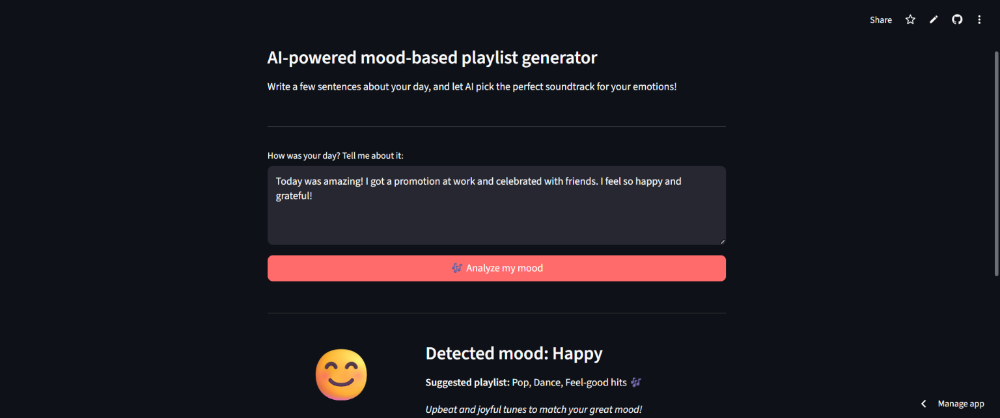
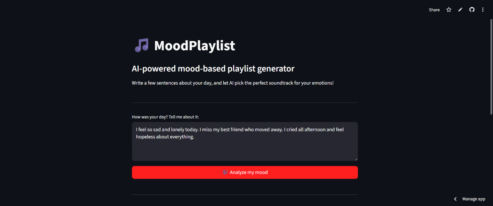

<div align="center">

🇬🇧 [English version](#english) | 🇫🇷 [Version française](#french)

</div>

---

<a name="english"></a>

# MoodPlaylist

Building AI course project


## Summary

MoodPlaylist is a Python-based AI tool that analyzes the sentiment of short diary entries to detect your mood and suggest a matching music playlist genre. Write a few sentences about your day, and let AI pick the perfect soundtrack for your emotions.

## Screenshots

### Happy Mood Detection


### Sad Mood Detection


## 🚀 Try it online (Live Demo)

You can test MoodPlaylist directly in your browser, no installation required:

👉 **[Launch MoodPlaylist on Streamlit](https://moodplaylist-adwnsvcn4cgsuuuoaayasc.streamlit.app/)**


## 📦 Installation (Local)

### Prerequisites

- Python 3.8 or higher
- pip (Python package manager)
- Git

### Step 1: Clone the repository

```bash
git clone https://github.com/thierrymaesen/MoodPlaylist.git
cd MoodPlaylist
```

### Step 2: Create a virtual environment (recommended)

```bash
python -m venv venv
source venv/bin/activate        # Linux / macOS
venv\Scripts\activate           # Windows
```

### Step 3: Install dependencies

```bash
pip install -r requirements.txt
```

### Step 4: Download NLTK data (first time only)

```bash
python -m textblob.download_corpora
```

### Step 5: Run the application

**Option A — Command-line version:**

```bash
python moodplaylist.py
```

**Option B — Web interface (Streamlit):**

```bash
streamlit run app.py
```

The app will open in your browser at `http://localhost:8501`.

## 🌐 Free Deployment (Streamlit Community Cloud)

To let anyone test your app online for free:

1. Go to [share.streamlit.io](https://share.streamlit.io/)
2. Sign in with your GitHub account
3. Click **"New app"**
4. Select repository: `thierrymaesen/MoodPlaylist`
5. Branch: `main`
6. Main file path: `app.py`
7. Click **"Deploy!"**

Your app will be live at a public URL like:
`https://moodplaylist-thierrymaesen.streamlit.app/`

It's 100% free for public repositories.

## Background

Many people listen to music to match or improve their mood, but choosing the right playlist can be tedious. The problems this project addresses:

- People often struggle to identify their own emotional state clearly
- Manually searching for mood-appropriate music takes time and effort
- Existing music recommendation systems rely on listening history, not on how you actually feel right now

My personal motivation comes from the daily habit of journaling and listening to music. Combining both activities with AI felt like a natural and practical idea. Mood-based recommendations can also support mental well-being by helping people become more aware of their emotions.

## How is it used?

The user opens the web interface (or command-line application) and types a short text about their day, feelings, or current state of mind. The program analyzes the text using sentiment analysis (NLP) and classifies the mood into categories such as: happy, sad, stressed, calm, or energetic.

Based on the detected mood, the application suggests a playlist genre or ambiance:

- Happy → Pop, Dance, Feel-good hits
- Sad → Acoustic, Lo-fi, Soft ballads
- Stressed → Nature sounds, Ambient, Meditation
- Calm → Classical, Jazz, Chill
- Energetic → Rock, EDM, Workout beats

Example usage:

```
python moodplaylist.py

How was your day? Tell me about it:
> Today was amazing! I got a promotion at work and celebrated with friends.

Detected mood: Happy 😊
Suggested playlist: Pop / Feel-good hits 🎶
```

The solution is designed for anyone who journals or wants a quick music suggestion. It can be used at any time of day, on any device with Python installed or via the web demo. It is especially useful for people who use music as a tool for emotional regulation.

## Data sources and AI methods

The project uses the following data and techniques:

- **Text input:** User-provided diary entries (free text)
- **Sentiment analysis:** Using Python's TextBlob library for natural language processing
- **Mood classification:** Rule-based mapping from sentiment polarity/subjectivity scores to mood categories, boosted by keyword detection (hybrid approach)
- **Playlist mapping:** A predefined dictionary mapping moods to music genres

| Technique | Purpose |
|-----------|---------|
| NLP (Sentiment Analysis) | Detect emotion from text |
| Hybrid classification (keywords + polarity) | Map sentiment scores to mood categories |
| Dictionary lookup | Suggest playlist genre based on mood |

No external API or paid service is required. Everything runs locally with Python.

## Project structure

```
MoodPlaylist/
├── moodplaylist.py        # CLI version (command-line)
├── app.py                 # Web version (Streamlit)
├── requirements.txt       # Python dependencies
├── .streamlit/
│   └── config.toml        # Streamlit theme configuration
├── moodplaylist_v2.png    # Project screenshot
└── README.md              # This file
```

## Challenges

This project does not solve the following:

- It cannot detect complex or mixed emotions with high accuracy (e.g., feeling nostalgic yet happy)
- Sarcasm and irony in text are difficult to interpret correctly with basic sentiment analysis
- The playlist suggestions are generic genres, not actual song lists (integration with Spotify API could be a future improvement)
- The system works best in English; multilingual support would require additional NLP models

Ethical considerations: the tool processes personal text entries, so privacy must be ensured. All processing happens locally, and no data is stored or shared.

## What next?

This project could grow in several ways:

- Integrate with the Spotify or YouTube Music API to generate real playlists automatically
- ~~Add a simple web interface using Flask or Streamlit for a better user experience~~ ✅ Done!
- Use a more advanced NLP model (like a fine-tuned transformer) for better emotion detection
- Support multiple languages for a wider audience
- Add a mood tracking dashboard that visualizes emotional patterns over time

To move forward, I would need skills in API integration, web development, and possibly deep learning for improved NLP.

## Acknowledgments

- This project was inspired by the [Building AI course](https://buildingai.elementsofai.com/) created by Reaktor Innovations and University of Helsinki
- Sentiment analysis powered by [TextBlob](https://textblob.readthedocs.io/) / [NLTK](https://www.nltk.org/) — open source Python libraries
- Web interface built with [Streamlit](https://streamlit.io/) — open source Python framework
- Sleeping cat image example from the course template by [Umberto Salvagnin](https://commons.wikimedia.org/wiki/User:Umberto_Salvagnin) / [CC BY 2.0](https://creativecommons.org/licenses/by/2.0/)

---

<a name="french"></a>

# MoodPlaylist

Projet du cours Building AI


## Résumé

MoodPlaylist est un outil IA basé sur Python qui analyse le sentiment de courtes entrées de journal intime pour détecter votre humeur et suggérer un genre de playlist musicale correspondant. Écrivez quelques phrases sur votre journée et laissez l'IA choisir la bande-son parfaite pour vos émotions.

## Captures d'écran

### Détection d'humeur : Joyeux


### Détection d'humeur : Triste


## 🚀 Essayer en ligne (Démo live)

Vous pouvez tester MoodPlaylist directement dans votre navigateur, sans rien installer :

👉 **[Lancer MoodPlaylist sur Streamlit](https://moodplaylist-adwnsvcn4cgsuuuoaayasc.streamlit.app/)**


## 📦 Installation (en local)

### Prérequis

- Python 3.8 ou supérieur
- pip (gestionnaire de paquets Python)
- Git

### Étape 1 : Cloner le dépôt

```bash
git clone https://github.com/thierrymaesen/MoodPlaylist.git
cd MoodPlaylist
```

### Étape 2 : Créer un environnement virtuel (recommandé)

```bash
python -m venv venv
source venv/bin/activate        # Linux / macOS
venv\Scripts\activate           # Windows
```

### Étape 3 : Installer les dépendances

```bash
pip install -r requirements.txt
```

### Étape 4 : Télécharger les données NLTK (première fois uniquement)

```bash
python -m textblob.download_corpora
```

### Étape 5 : Lancer l'application

**Option A — Version ligne de commande :**

```bash
python moodplaylist.py
```

**Option B — Interface web (Streamlit) :**

```bash
streamlit run app.py
```

L'application s'ouvrira dans votre navigateur à l'adresse `http://localhost:8501`.

## 🌐 Déploiement gratuit (Streamlit Community Cloud)

Pour permettre à n'importe qui de tester votre application en ligne gratuitement :

1. Allez sur [share.streamlit.io](https://share.streamlit.io/)
2. Connectez-vous avec votre compte GitHub
3. Cliquez sur **"New app"**
4. Sélectionnez le dépôt : `thierrymaesen/MoodPlaylist`
5. Branche : `main`
6. Fichier principal : `app.py`
7. Cliquez sur **"Deploy!"**

Votre application sera accessible à une URL publique comme :
`https://moodplaylist-thierrymaesen.streamlit.app/`

C'est 100% gratuit pour les dépôts publics.

## Contexte

Beaucoup de gens écoutent de la musique pour accompagner ou améliorer leur humeur, mais choisir la bonne playlist peut être fastidieux. Les problèmes que ce projet aborde :

- Les gens ont souvent du mal à identifier clairement leur propre état émotionnel
- Chercher manuellement de la musique adaptée à son humeur prend du temps et de l'énergie
- Les systèmes de recommandation musicale existants se basent sur l'historique d'écoute, pas sur ce que vous ressentez réellement en ce moment

Ma motivation personnelle vient de l'habitude quotidienne d'écrire un journal et d'écouter de la musique. Combiner les deux activités avec l'IA m'a semblé être une idée naturelle et pratique. Les recommandations basées sur l'humeur peuvent aussi soutenir le bien-être mental en aidant les gens à mieux prendre conscience de leurs émotions.

## Comment l'utiliser ?

L'utilisateur ouvre l'interface web (ou l'application en ligne de commande) et tape un court texte sur sa journée, ses sentiments ou son état d'esprit actuel. Le programme analyse le texte à l'aide de l'analyse de sentiment (NLP) et classe l'humeur en catégories telles que : joyeux, triste, stressé, calme ou énergique.

En fonction de l'humeur détectée, l'application suggère un genre de playlist ou une ambiance :

- Joyeux → Pop, Dance, Tubes feel-good
- Triste → Acoustique, Lo-fi, Ballades douces
- Stressé → Sons de la nature, Ambient, Méditation
- Calme → Classique, Jazz, Chill
- Énergique → Rock, EDM, Musique d'entraînement

Exemple d'utilisation :

```
python moodplaylist.py

Comment s'est passée votre journée ? Racontez-moi :
> Aujourd'hui était incroyable ! J'ai eu une promotion au travail et j'ai fêté ça avec des amis.

Humeur détectée : Joyeux 😊
Playlist suggérée : Pop / Tubes feel-good 🎶
```

La solution est conçue pour tous ceux qui tiennent un journal ou veulent une suggestion musicale rapide. Elle peut être utilisée à tout moment de la journée, sur n'importe quel appareil avec Python installé ou via la démo web. Elle est particulièrement utile pour les personnes qui utilisent la musique comme outil de régulation émotionnelle.

## Sources de données et méthodes IA

Le projet utilise les données et techniques suivantes :

- **Entrée texte :** Entrées de journal fournies par l'utilisateur (texte libre)
- **Analyse de sentiment :** Utilisation de TextBlob de Python pour le traitement du langage naturel
- **Classification de l'humeur :** Mappage basé sur des règles depuis les scores de polarité/subjectivité vers des catégories d'humeur, enrichi par la détection de mots-clés (approche hybride)
- **Mappage des playlists :** Un dictionnaire prédéfini associant les humeurs aux genres musicaux

| Technique | Objectif |
|-----------|----------|
| NLP (Analyse de Sentiment) | Détecter l'émotion à partir du texte |
| Classification hybride (mots-clés + polarité) | Associer les scores de sentiment aux catégories d'humeur |
| Recherche dans un dictionnaire | Suggérer un genre de playlist selon l'humeur |

Aucune API externe ou service payant n'est requis. Tout fonctionne localement avec Python.

## Structure du projet

```
MoodPlaylist/
├── moodplaylist.py        # Version CLI (ligne de commande)
├── app.py                 # Version web (Streamlit)
├── requirements.txt       # Dépendances Python
├── .streamlit/
│   └── config.toml        # Configuration du thème Streamlit
├── moodplaylist_v2.png    # Capture d'écran du projet
└── README.md              # Ce fichier
```

## Défis

Ce projet ne résout pas les problèmes suivants :

- Il ne peut pas détecter les émotions complexes ou mixtes avec une grande précision (par ex., se sentir nostalgique et heureux à la fois)
- Le sarcasme et l'ironie dans le texte sont difficiles à interpréter correctement avec une analyse de sentiment basique
- Les suggestions de playlists sont des genres génériques, pas des listes de chansons réelles (l'intégration de l'API Spotify pourrait être une amélioration future)
- Le système fonctionne mieux en anglais ; le support multilingue nécessiterait des modèles NLP supplémentaires

Considérations éthiques : l'outil traite des entrées de texte personnelles, la confidentialité doit donc être assurée. Tout le traitement se fait localement et aucune donnée n'est stockée ou partagée.

## Et ensuite ?

Ce projet pourrait évoluer de plusieurs façons :

- Intégration avec l'API Spotify ou YouTube Music pour générer automatiquement de vraies playlists
- ~~Ajout d'une interface web simple avec Flask ou Streamlit pour une meilleure expérience utilisateur~~ ✅ Fait !
- Utilisation d'un modèle NLP plus avancé (comme un transformer fine-tuné) pour une meilleure détection des émotions
- Support de plusieurs langues pour un public plus large
- Ajout d'un tableau de bord de suivi de l'humeur qui visualise les tendances émotionnelles au fil du temps

Pour aller plus loin, j'aurais besoin de compétences en intégration d'API, développement web, et éventuellement en deep learning pour améliorer le NLP.

## Remerciements

- Ce projet a été inspiré par le cours [Building AI](https://buildingai.elementsofai.com/) créé par Reaktor Innovations et l'Université de Helsinki
- Analyse de sentiment propulsée par [TextBlob](https://textblob.readthedocs.io/) / [NLTK](https://www.nltk.org/) — bibliothèques Python open source
- Interface web construite avec [Streamlit](https://streamlit.io/) — framework Python open source
- Image du chat endormi exemple du template du cours par [Umberto Salvagnin](https://commons.wikimedia.org/wiki/User:Umberto_Salvagnin) / [CC BY 2.0](https://creativecommons.org/licenses/by/2.0/)
